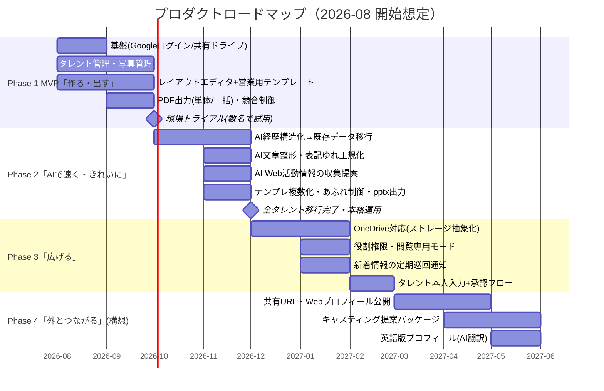

# プロダクトロードマップ

タレントプロフィール作成・メンテナンスツール
作成日: 2026-07-30 ／ 要件定義 v0.4 準拠

## プロダクトビジョン

> **「宣材づくりを、作業からワンクリックへ。」**
> タレント情報を一度入力すれば、営業・オーディション・Web のどこへでも、
> 事務所ブランドの整った最新プロフィールが数分で届く状態をつくる。

段階的な価値提供の考え方:

| 段階 | テーマ | 提供価値 |
|---|---|---|
| Phase 1 | **作る・出す** | Word/PPT 手作業の置き換え。誰でも 15 分でプロフィール完成 |
| Phase 2 | **AI で速く・きれいに** | 文章・経歴のメンテナンスを AI が下支え。既存資料からの移行完了 |
| Phase 3 | **広げる** | OneDrive・権限・本人入力など、利用範囲と運用の拡大 |
| Phase 4 | **外とつながる** | 宣材ツールから「営業支援基盤」へ。事務所の外への価値提供 |

---

## タイムライン（目安）

---

## Phase 1: MVP「作る・出す」（開始〜2 か月）

**ゴール**: Word / PowerPoint での手作業を置き換え、「入力 → プレビュー → PDF」が 15 分で完了する。

- Google ログイン＋共有ドライブ保存基盤（Workspace ドメイン限定）
- タレント管理（登録・検索・一覧 500 名対応）／写真管理（D&D・トリミング）
- レイアウトエディタ（ドラッグ移動・リサイズ・スナップ・書式・データバインド）
- 営業用テンプレート同梱（実物サンプル様式を再現、ロゴ入りフッター共通反映）
- PDF 出力（単体・一括）／同時編集の競合制御／ZIP バックアップ

**マイルストーン**: 現場スタッフ数名でのトライアル開始（実タレント 10〜20 名分で試用）

**主要 KPI**: プロフィール新規作成 2 時間 → **15 分**／更新 30 分 → **5 分**

## Phase 2: 「AI で速く・きれいに」（2〜4 か月）

**ゴール**: 既存 Word/PPT 資料から全タレントのデータ移行を完了し、日常メンテナンスに AI が入る。

- AI 経歴構造化（既存資料の貼り付け → 明細自動変換）**→ これを使って 50〜500 名の初期移行**
- AI 文章整形・校正（自己紹介・PR 文）／表記ゆれ正規化
- AI Web 活動情報の収集提案（情報源 URL 付き・人の承認制）
- テンプレート複数管理・タレント個別調整・あふれ制御
- pptx / 画像出力、出力履歴、更新リマインド

**マイルストーン**: 全タレント移行完了・事務所の正式ワークフローに採用

**主要 KPI**: 移行済みタレント比率 100%／経歴の最終更新からの平均経過日数

## Phase 3: 「広げる」（4〜6 か月）

**ゴール**: 利用者・保存先・運用の広がりに対応する。

- **OneDrive 対応**（StorageAdapter に MicrosoftGraphAdapter を追加。UI・データ形式は無改修）
- 役割権限（管理者のみテンプレート編集等）・閲覧専用モード
- 新着情報の定期巡回通知（AI が出演情報を見つけたら知らせる）
- タレント本人によるスマホ入力 → 事務所承認フロー

**主要 KPI**: 同時利用ユーザー数／本人入力による更新の割合

## Phase 4: 「外とつながる」（6 か月〜・構想）

**ゴール**: 宣材ツールを超えて、事務所の営業活動を支える基盤に育てる。

- 共有 URL・Web プロフィール公開（期限付きリンク、事務所サイトへの埋め込み）
- キャスティング提案パッケージ（条件でタレントを選抜 → 提案資料・リンク集を一括生成）
- 英語版プロフィール（AI 翻訳・海外案件対応）
- 動画資料の管理強化（リール・出演映像のライブラリ化）
- （事業判断）他事務所への外販・SaaS 化の検討

**主要 KPI**: 提案パッケージ経由の案件数／外部閲覧数

---

## 判断ポイント（ロードマップの見直しタイミング）

| 時期 | 判断すること |
|---|---|
| Phase 1 トライアル後 | エディタの操作感・PDF 品質が現場基準を満たすか。Phase 2 の優先順位（AI 移行を先にするか、テンプレ拡張を先にするか） |
| Phase 2 完了時 | 運用定着度。OneDrive 対応の実需（Phase 3 の着手順） |
| Phase 3 完了時 | Phase 4 のどこまでを内製で進めるか。外販・SaaS 化の事業性評価 |

※ 工数目安は 1 名開発想定。並行開発や AI 活用により短縮可能。
